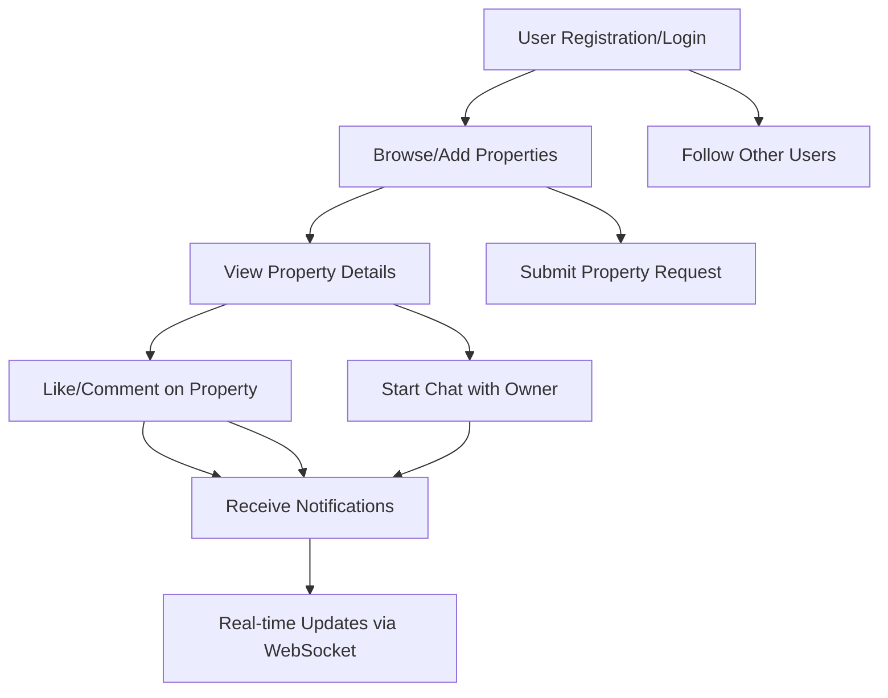

# Msakin Real Estate Platform

Msakin is a comprehensive real estate management platform built with Django, supporting real-time user interaction.

## Main Features
- Property management: add, edit, delete, view, and upload multiple images.
- Advanced comments and likes system (including nested comments).
- Real-time chat between users (WebSocket support).
- Instant notifications on all user interactions.
- Social follow system between users.
- User account and profile management.
- REST API endpoints for some services.

## Project Structure
```
src/
├── accounts         # User management and profiles
├── chat             # Real-time chat between users
├── home             # Main website pages
├── msakin           # Project settings and routing
├── notifications    # Notification system
├── properties       # Property management, comments, images
├── static           # Static files (CSS, JS)
├── media            # User-uploaded files and images
├── templates        # HTML templates
├── manage.py        # Project management script
├── requirements.txt # Project dependencies
```

---

## Workflow Diagram (User Journey)
Below is a simplified workflow showing how users interact with the main features:



---

## System Architecture Diagram
This diagram shows the high-level architecture and how the main components interact:

```mermaid
flowchart LR
    subgraph Client
        U1[User Browser]
    end
    subgraph Backend
        DJ[Django Server]
        CH[Django Channels (WebSocket)]
        DB[(Database)]
        FS[(File Storage)]
    end
    U1 -- HTTP/REST --> DJ
    U1 -- WebSocket --> CH
    DJ -- ORM --> DB
    DJ -- File Upload/Download --> FS
    CH -- Real-time Events --> DJ
    DJ -- Notify --> CH
```

## Requirements
- Python 3.10+
- Django 4+
- Django Channels
- Pillow
- Django REST Framework

## خطوات التشغيل
1. تثبيت المتطلبات:
   ```bash
   pip install -r requirements.txt
   ```
2. ترحيل قاعدة البيانات:
   ```bash
   python manage.py migrate
   ```
3. إنشاء مستخدم مدير:
   ```bash
   python manage.py createsuperuser
   ```
4. تشغيل السيرفر:
   ```bash
   python manage.py runserver
   ```

## Technical Notes
- The system supports WebSockets for chat and notifications.
- Users and properties can have multiple images.
- The project structure makes it easy to add new features or apps.

## Contributions
To contribute or report issues, please open an issue or pull request.

---

Msakin Real Estate Platform - All rights reserved © 2025
